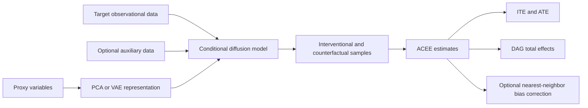

# Augmented Causal Effect Estimation (ACEE)

[](https://arxiv.org/abs/2504.03630)
[](https://www.python.org/)
[](https://pytorch.org/)
[](LICENSE)

Official implementation of **“Enhancing Causal Effect Estimation with Diffusion-Generated Data”** by Li Chen, Xiaotong Shen, and Wei Pan.

ACEE uses conditional diffusion models to augment observed data with samples from intervention-relevant conditional distributions. The framework supports individual and average treatment effects, total effects in directed acyclic graphs (DAGs), proxy adjustment for unmeasured confounding, and optional nearest-neighbor bias correction.

## Method at a glance



The repository contains the paper’s potential-outcome experiments (M1–M4), DAG experiments, proxy-confounding studies, transfer-learning experiments, IHDP evaluation, causal-discovery example, proxy-assumption diagnostic, and computation-time study.

## Installation

Python 3.10–3.12 is recommended for compatibility with the pinned PyTorch release. Create an isolated environment and install the dependencies:

```bash
python -m venv .venv

# Linux/macOS
source .venv/bin/activate

# Windows PowerShell
.venv\Scripts\Activate.ps1

python -m pip install --upgrade pip
python -m pip install -r requirements.txt
```

Most full experiments train diffusion models and are substantially faster on a CUDA-capable GPU. Use the scripts’ `--device cpu` option when a GPU is unavailable.

## Quick start

Run commands from the repository root. The following small data-generation checks do not train a diffusion model:

```bash
# Potential-outcome data for one small M1 replicate
python simulations/generate_potential_outcomes.py \
  --scenarios M1 --n_seeds 1 --n_sizes 100 --n_size_ite 20 --ate_mc_samples 1000

# One small DAG dataset
python simulations/generate_dag_data.py \
  --scenarios nonlin_simpson --n_samples 100 --n_seeds 1 --ate_mc_samples 1000
```

Generated files are written under `data/` by default and are ignored by Git.

## Reproducing the manuscript experiments

| Manuscript component | Data generation | ACEE estimation / analysis |
| --- | --- | --- |
| Potential outcomes M1–M4 | `simulations/generate_potential_outcomes.py` | `simulations/potential_outcomes_m1.py` through `potential_outcomes_m4.py`; `potential_outcomes_bias_correction.py` |
| DAG effects G1, G1+, G2, G2+, G3 | `simulations/generate_dag_data.py` | `simulations/acee_nonlin_simpson.py`, `acee_symprod_simpson.py`, `acee_sachs.py` |
| Unmeasured confounding and proxy factors | `simulations/DataGen_*_UM.py` | `simulations/*_UM.py` and `*_UM_factor.py` |
| Positive and negative transfer | `transfer_learning/DataGen_TM.py` | `transfer_learning/TM_positive.py`, `TM_negative.py`, and the `_bc.py` variants |
| IHDP | Retained data in `IHDP/data/` | `IHDP/IHDP_ACEE.py` |
| Causal discovery | `examples/discovery_data.py` | `examples/discovery.py` and `examples/discovery.ipynb` |
| Proxy-assumption diagnostic | Generated internally | `examples/Assumption_Check.py` and `examples/Assumption_Check.ipynb` |
| Computational scalability | `computation_scalability/DataGen_*.py` | `computation_scalability/*computation_time*.py` |

For a complete run, first generate the relevant datasets and then execute the corresponding estimation script. Each entry point exposes its experiment settings with `--help`. For example:

```bash
python simulations/generate_potential_outcomes.py --help
python simulations/potential_outcomes_m1.py --help
python IHDP/IHDP_ACEE.py --help
```

Summary scripts are colocated with their experiments. They can optionally read externally produced comparison results, but implementations of competing methods are intentionally not included in this repository.

## Examples

The causal-discovery workflow evaluates candidate graphs for data generated from the manuscript’s G2 structure, which includes both the chain and direct edge `X1 -> X3`:

```bash
python examples/discovery_data.py
python examples/discovery.py
```

The proxy diagnostic compares a scenario that violates the required proxy condition with one that satisfies it:

```bash
python examples/Assumption_Check.py
```

See [`examples/README_Discovery.md`](examples/README_Discovery.md) and [`examples/README_Assumption_Check.md`](examples/README_Assumption_Check.md) for interpretation and output details.

## Repository layout

```text
ACEE/
├── simulations/              # Synthetic potential-outcome, DAG, and proxy studies
├── transfer_learning/        # Positive/negative transfer and bias correction
├── IHDP/                     # IHDP experiment and retained benchmark data
├── examples/                 # Discovery and proxy-diagnostic examples
├── computation_scalability/  # Runtime and scaling experiments
├── utils/                    # Diffusion, neural-network, and data utilities
├── requirements.txt
└── README.md
```

Generated datasets, checkpoints, and results are excluded through `.gitignore`. The two benchmark arrays under `IHDP/data/` are retained so the IHDP experiment is directly reproducible.

## Citation

If this code is useful in your research, please cite:

```bibtex
@article{chen2025enhancing,
  title={Enhancing causal effect estimation with diffusion-generated data},
  author={Chen, Li and Shen, Xiaotong and Pan, Wei},
  journal={arXiv preprint arXiv:2504.03630},
  year={2025}
}
```

## License

This project is released under the [MIT License](LICENSE).
